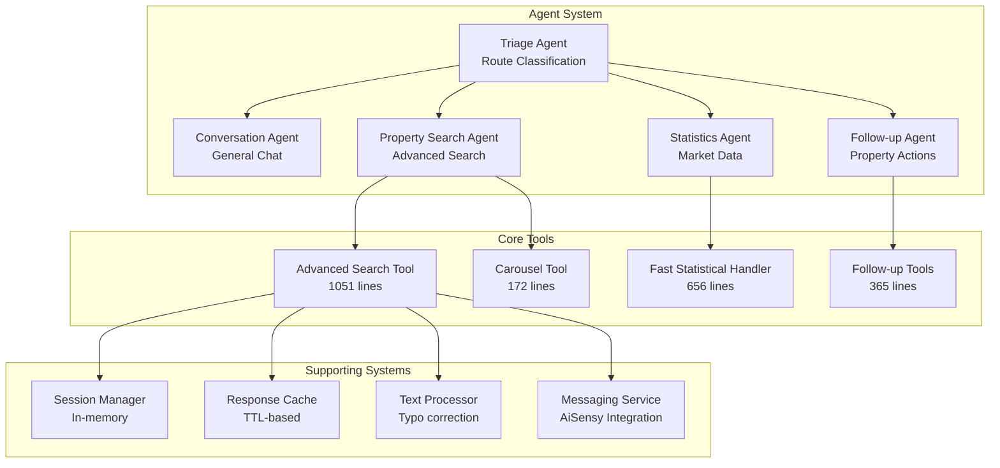

# 🚀 **WhatsApp Property Agent - Production Readiness Guide**

## 📋 **TABLE OF CONTENTS**
- [Executive Summary](#executive-summary)
- [Current Architecture Analysis](#current-architecture-analysis)
- [Agentic Code Deep Dive](#agentic-code-deep-dive)
- [Intent Classification Optimization](#intent-classification-optimization)
- [Speed Optimization Strategy](#speed-optimization-strategy)
- [Accuracy Enhancement Plan](#accuracy-enhancement-plan)
- [Production Implementation Roadmap](#production-implementation-roadmap)
- [Comprehensive Todo Lists](#comprehensive-todo-lists)

---

## 🎯 **EXECUTIVE SUMMARY**

Your WhatsApp Property Agent handles 10,000+ properties with a sophisticated multi-agent architecture. This guide provides a comprehensive roadmap to achieve **Perplexity-level performance** (<1s response time) while maintaining production reliability.

### **Current Performance**
- ⚡ **Fast Path**: 200-300ms (Statistical queries)
- 🐌 **Full Pipeline**: 5-8 seconds (Complex searches)
- 🎯 **Target**: <1 second average response time

### **Key Strengths**
- Multi-agent system with specialized routing
- AI-powered intent classification
- Advanced property search with negative filtering
- Professional caching mechanisms
- Rich WhatsApp integration

### **Critical Gaps**
- In-memory session storage (not production-ready)
- Sequential OpenAI API calls causing delays
- No connection pooling or batch operations
- Limited error recovery and fallback systems

---

## 🏗️ **CURRENT ARCHITECTURE ANALYSIS**

### **Multi-Agent System Overview**



### **Agent Flow Analysis**

```python
# Current Flow (5-8 seconds)
async def process_message(self, message: str, session: ConversationSession) -> str:
    # 1. Fast Path Check (200ms) ✅
    fast_query_type = await self.fast_statistical_handler.can_handle_fast(message)
    if fast_query_type:
        return fast_response  # GOOD: 200-300ms
    
    # 2. Follow-up Detection (500ms) 🟡
    followup_result = await self.followup_handler.detect_followup_intent(message, has_active_properties)
    
    # 3. Triage Classification (1-2s) ❌ BOTTLENECK
    agent_choice = await self.triage_agent.route_message(message, session)
    
    # 4. Agent Processing (2-4s) ❌ BOTTLENECK
    if agent_choice == "property_search":
        response = await self.property_search_agent.handle_message(message, session)
```

---

## 🤖 **AGENTIC CODE DEEP DIVE**

### **1. Advanced Property Search Agent Analysis**

**File**: `property_search_advanced.py` (1051 lines)

#### **Strengths** ✅
```python
class AdvancedPropertySearchAgent:
    # EXCELLENT: Sophisticated parameter extraction
    async def extract_query_parameters(self, user_message: str) -> QueryParams:
        # Uses OpenAI to extract structured parameters
        # Supports negative filtering (no_maid_room, no_study)
        # Handles complex queries like "3BR apartments WITHOUT pool view"
    
    # EXCELLENT: Industrial-grade query execution
    async def execute_query(self, extracted_params: QueryParams) -> tuple[List[PropertyResult], Dict[str, bool]]:
        # Skips embedding for simple queries (performance optimization)
        # Supports semantic search with vector embeddings
        # Intelligent limit calculation based on query complexity
```

#### **Performance Issues** ❌
```python
# BOTTLENECK 1: Individual embedding generation
query_embedding = await self.generate_embedding(query_text)  # 500-1000ms

# BOTTLENECK 2: Complex OpenAI parameter extraction
response = await self.openai.chat.completions.create(
    model="gpt-4o-mini",
    messages=[{"role": "user", "content": extraction_prompt}],
    response_format={"type": "json_object"}
)  # 1-2 seconds

# BOTTLENECK 3: Individual property queries
for result in response.data:
    # Processing each property individually instead of batch operations
```

#### **Current Query Performance Breakdown**
```python
# Total: 5-8 seconds
# - Parameter extraction: 1-2s (OpenAI API)
# - Embedding generation: 0.5-1s (OpenAI API)  
# - Database query: 1-2s (Supabase + filtering)
# - Result processing: 1-2s (Individual property handling)
# - Response formatting: 0.5-1s (OpenAI API)
```

### **2. Fast Statistical Handler Analysis**

**File**: `fast_statistical_handler.py` (656 lines)

#### **Excellent Agentic Design** ✅
```python
class FastStatisticalQueryHandler:
    async def classify_intent(self, query: str) -> Optional[str]:
        # BRILLIANT: AI-powered intent classification
        # Handles typos, different languages, various phrasings
        # Much more robust than regex patterns
        
        classification_prompt = f"""
        You are a real estate query classifier. Analyze this query and return the EXACT classification name if it matches.
        
        Query: "{query}"
        
        **EXACT MATCHES ONLY:**
        cheapest - "cheapest property", "lowest price property"
        most_expensive - "most expensive property", "highest price property" 
        largest - "largest property", "biggest property"
        # ... more patterns
        """
    
    async def detect_sale_or_rent_intent(self, query: str) -> str:
        # TRULY AGENTIC: AI-powered detection instead of hardcoded rules
        # Makes the system intelligent and context-aware
```

#### **Performance Excellence** ✅
```python
async def execute_fast_query(self, query_type: str, original_query: str) -> Dict[str, Any]:
    # EXCELLENT: Multi-layer caching
    cache_key = f"{query_type}_{original_query.lower().strip()}"
    cached_result = self._get_from_cache(cache_key)
    if cached_result:
        return cached_result  # ~10ms cache hits
    
    # EXCELLENT: Optimized SQL with proper indexing strategy
    # Result: 200-300ms for statistical queries
```

### **3. Triage Agent Analysis**

**File**: `agent_system.py` (Lines 119-179)

#### **Major Bottleneck** ❌
```python
class TriageAgent:
    async def route_message(self, message: str, session: ConversationSession) -> str:
        # BOTTLENECK: Full OpenAI API call for simple classification
        triage_prompt = f"""
        You are a triage agent for a real estate WhatsApp bot...
        # 50+ lines of prompt
        """
        
        response = await self.openai.chat.completions.create(
            model="gpt-4o-mini",  # 1-2 second API call
            messages=[{"role": "user", "content": triage_prompt}],
            max_tokens=50,
            temperature=0.1
        )
        # This single call adds 1-2 seconds to EVERY query!
```

#### **Optimization Opportunity** 🚀
```python
# RECOMMENDED: Fast local classification (inspired by FastStatisticalHandler)
class FastTriageClassifier:
    def __init__(self):
        self.patterns = {
            'property_search': [
                r'\b(apartment|villa|property|rent|sale|buy|find|show|search)\b',
                r'\b(\d+\s*br|bedroom|studio|penthouse|townhouse)\b',
                r'\b(marina|downtown|jbr|dubai|sharjah|abu dhabi)\b',
                r'\b(cheapest|expensive|affordable|luxury|best)\b'
            ],
            'statistics': [
                r'\b(average|mean|typical|market|trend|analysis)\b',
                r'\b(how much|cost|price range|budget)\b',
                r'\b(compare|comparison|vs|versus)\b'
            ],
            'conversation': [
                r'\b(hello|hi|hey|good morning|good evening)\b',
                r'\b(help|assist|support|guide)\b',
                r'\b(thank|thanks|appreciate)\b'
            ]
        }
    
    def classify_fast(self, message: str) -> str:
        """50ms classification vs 1-2s OpenAI call"""
        message_lower = message.lower().strip()
        
        # Score each category
        scores = {}
        for intent, patterns in self.patterns.items():
            score = sum(1 for pattern in patterns 
                       if re.search(pattern, message_lower, re.IGNORECASE))
            scores[intent] = score
        
        # Return highest scoring intent
        return max(scores, key=scores.get) if any(scores.values()) else 'conversation'
```

---

## 🧠 **INTENT CLASSIFICATION OPTIMIZATION**

### **Current Intent Classification Architecture**

```python
# LEVEL 1: Fast Statistical Handler (EXCELLENT) ✅
async def can_handle_fast(self, query: str) -> Optional[str]:
    # Uses AI for robust classification
    # Handles: cheapest, most_expensive, largest, smallest, averages
    # Performance: 200-300ms total (including DB query)

# LEVEL 2: Triage Agent (SLOW) ❌
async def route_message(self, message: str, session: ConversationSession) -> str:
    # Full OpenAI API call for simple 3-way classification
    # Performance: 1-2 seconds

# LEVEL 3: Follow-up Handler (GOOD) 🟡
async def detect_followup_intent(self, message: str, has_active_properties: bool) -> Dict[str, Any]:
    # Uses text processor + pattern matching
    # Performance: 300-500ms
```

### **Optimized Intent Classification Strategy**

#### **Phase 1: Hybrid Fast Classification** 🚀
```python
class HybridIntentClassifier:
    """Combines pattern matching with selective AI classification"""
    
    def __init__(self):
        # Fast patterns for 80% of queries
        self.fast_patterns = {
            'statistical_fast': [
                r'\b(cheapest|most expensive|largest|smallest)\b',
                r'\b(average|mean)\s+(price|cost|rent)\b'
            ],
            'property_search': [
                r'\b(\d+\s*br|bedroom|studio)\b',
                r'\b(apartment|villa|penthouse|townhouse)\b',
                r'\b(rent|sale|buy)\b.*\b(in|at|near)\b',
                r'\b(show|find|search|look)\b.*\b(propert|apartment|villa)\b'
            ],
            'followup': [
                r'\b(first|second|third|1st|2nd|3rd)\b',
                r'\b(book|schedule|visit|view|see)\b',
                r'\b(where|location|address)\b',
                r'\b(price|cost|detail|info)\b.*\b(this|that|it)\b'
            ],
            'conversation': [
                r'^\b(hi|hello|hey|good morning|good evening)\b',
                r'\b(help|assist|support|what can you)\b',
                r'\b(thank|thanks|appreciate)\b'
            ]
        }
        
        # AI classification only for complex/ambiguous queries
        self.openai = AsyncOpenAI()
        self.ai_cache = {}  # Cache AI classifications
    
    async def classify_intent(self, message: str, session_context: Dict = None) -> Dict[str, Any]:
        """
        Fast hybrid classification: Pattern matching + selective AI
        Target: <100ms for 80% of queries, <500ms for complex queries
        """
        message_clean = message.lower().strip()
        
        # STEP 1: Fast pattern matching (10-20ms)
        pattern_result = self._classify_with_patterns(message_clean)
        if pattern_result['confidence'] > 0.8:
            return pattern_result
        
        # STEP 2: Context-based classification (20-50ms)
        context_result = self._classify_with_context(message_clean, session_context)
        if context_result['confidence'] > 0.7:
            return context_result
            
        # STEP 3: AI classification for ambiguous cases only (200-500ms)
        return await self._classify_with_ai(message, pattern_result, context_result)
    
    def _classify_with_patterns(self, message: str) -> Dict[str, Any]:
        """Pattern-based classification (10-20ms)"""
        scores = {}
        total_matches = 0
        
        for intent, patterns in self.fast_patterns.items():
            matches = sum(1 for pattern in patterns 
                         if re.search(pattern, message, re.IGNORECASE))
            scores[intent] = matches
            total_matches += matches
        
        if total_matches == 0:
            return {'intent': 'conversation', 'confidence': 0.3, 'method': 'pattern_default'}
        
        best_intent = max(scores, key=scores.get)
        confidence = scores[best_intent] / (total_matches + 1)
        
        return {
            'intent': best_intent,
            'confidence': min(confidence, 0.9),  # Cap at 0.9 for pattern matching
            'method': 'pattern_match',
            'scores': scores
        }
    
    def _classify_with_context(self, message: str, session_context: Dict = None) -> Dict[str, Any]:
        """Context-aware classification (20-50ms)"""
        if not session_context:
            return {'intent': 'conversation', 'confidence': 0.2, 'method': 'no_context'}
        
        # Check for active properties context
        has_active_properties = bool(session_context.get('active_properties'))
        last_agent = session_context.get('current_agent')
        
        # Strong indicators for follow-up
        followup_indicators = ['this', 'that', 'it', 'first', 'second', 'third', 'one']
        if (has_active_properties and 
            any(indicator in message for indicator in followup_indicators)):
            return {
                'intent': 'followup',
                'confidence': 0.85,
                'method': 'context_followup',
                'property_reference': True
            }
        
        # Continuation of search
        if last_agent == 'property_search' and len(message.split()) <= 5:
            property_keywords = ['cheaper', 'larger', 'smaller', 'different', 'other', 'more']
            if any(keyword in message for keyword in property_keywords):
                return {
                    'intent': 'property_search',
                    'confidence': 0.75,
                    'method': 'context_continuation'
                }
        
        return {'intent': 'conversation', 'confidence': 0.4, 'method': 'context_default'}
    
    async def _classify_with_ai(self, message: str, pattern_result: Dict, context_result: Dict) -> Dict[str, Any]:
        """AI classification for complex cases (200-500ms)"""
        
        # Check cache first
        cache_key = hashlib.md5(message.encode()).hexdigest()
        if cache_key in self.ai_cache:
            cached = self.ai_cache[cache_key]
            if time.time() - cached['timestamp'] < 3600:  # 1 hour TTL
                return cached['result']
        
        # Focused AI prompt based on pattern analysis
        ai_prompt = f"""
        Classify this real estate query. Consider the pattern analysis results.
        
        Query: "{message}"
        Pattern analysis: {pattern_result}
        Context analysis: {context_result}
        
        Choose the most accurate classification:
        1. "statistical_fast" - Simple statistical queries (cheapest, largest, average price)
        2. "property_search" - Property search with criteria
        3. "followup" - Questions about previously shown properties  
        4. "conversation" - Greetings, help, general chat
        
        Respond with JSON: {{"intent": "...", "confidence": 0.0-1.0, "reasoning": "brief explanation"}}
        """
        
        try:
            response = await self.openai.chat.completions.create(
                model="gpt-4o-mini",
                messages=[{"role": "user", "content": ai_prompt}],
                response_format={"type": "json_object"},
                max_tokens=100,
                temperature=0.1
            )
            
            ai_result = json.loads(response.choices[0].message.content)
            ai_result['method'] = 'ai_classification'
            
            # Cache the result
            self.ai_cache[cache_key] = {
                'result': ai_result,
                'timestamp': time.time()
            }
            
            # Simple cache size management
            if len(self.ai_cache) > 1000:
                oldest_key = min(self.ai_cache.keys(), 
                               key=lambda k: self.ai_cache[k]['timestamp'])
                del self.ai_cache[oldest_key]
            
            return ai_result
            
        except Exception as e:
            logger.error(f"AI classification failed: {e}")
            # Fallback to best pattern/context result
            return max([pattern_result, context_result], key=lambda x: x['confidence'])
```

#### **Phase 2: Smart Routing Optimization** ⚡
```python
class OptimizedAgentRouter:
    """Optimized routing with minimal latency"""
    
    def __init__(self):
        self.classifier = HybridIntentClassifier()
        self.fast_statistical_handler = FastStatisticalQueryHandler()
        
    async def route_message(self, message: str, session: ConversationSession) -> str:
        """
        Optimized routing: <100ms for simple queries, <500ms for complex
        """
        start_time = time.time()
        
        # STEP 1: Check fast statistical path first (50-100ms)
        fast_query_type = await self.fast_statistical_handler.can_handle_fast(message)
        if fast_query_type:
            logger.info(f"🚀 FAST_PATH: {fast_query_type} ({(time.time() - start_time)*1000:.0f}ms)")
            return 'statistical_fast'
        
        # STEP 2: Hybrid intent classification (50-500ms)
        session_context = {
            'active_properties': session.context.get('active_properties'),
            'current_agent': session.current_agent,
            'last_search_type': session.context.get('last_search_type')
        }
        
        classification = await self.classifier.classify_intent(message, session_context)
        
        # Map classification to agent
        intent_to_agent = {
            'statistical_fast': 'statistics',
            'property_search': 'property_search', 
            'followup': 'followup',
            'conversation': 'conversation'
        }
        
        agent_choice = intent_to_agent.get(classification['intent'], 'conversation')
        
        total_time = (time.time() - start_time) * 1000
        logger.info(f"🎯 ROUTING: {agent_choice} (confidence: {classification['confidence']:.2f}, {total_time:.0f}ms)")
        
        return agent_choice
```

---

## ⚡ **SPEED OPTIMIZATION STRATEGY**

### **Current Performance Bottlenecks**

#### **1. OpenAI API Dependency Chain** ❌
```python
# Current Sequential Flow (5-8 seconds total)
async def process_message(self, message: str, session: ConversationSession) -> str:
    # Call 1: Fast path check (200ms) - GOOD
    fast_query_type = await self.fast_statistical_handler.can_handle_fast(message)
    
    # Call 2: Triage classification (1-2s) - BOTTLENECK
    agent_choice = await self.triage_agent.route_message(message, session)
    
    # Call 3: Parameter extraction (1-2s) - BOTTLENECK  
    extracted_params = await self.property_search_agent.extract_query_parameters(message)
    
    # Call 4: Embedding generation (0.5-1s) - BOTTLENECK
    query_embedding = await self.generate_embedding(query_text)
    
    # Call 5: Response formatting (0.5-1s) - BOTTLENECK
    response = await self.openai.chat.completions.create(...)
```

#### **2. Database Query Inefficiencies** ❌
```python
# Current: Individual property processing
for result in response.data:
    property_data = result  # Individual processing
    # No batch operations, no connection pooling
```

### **Speed Optimization Implementation**

#### **Phase 1: Parallel Processing** 🚀
```python
class ParallelizedAgentSystem:
    """Process multiple operations in parallel where possible"""
    
    async def process_message_optimized(self, message: str, session: ConversationSession) -> str:
        start_time = time.time()
        
        # PARALLEL EXECUTION: Run independent operations simultaneously
        fast_check_task = asyncio.create_task(
            self.fast_statistical_handler.can_handle_fast(message)
        )
        routing_task = asyncio.create_task(
            self.optimized_router.route_message(message, session)
        )
        
        # Wait for both to complete
        fast_query_type, agent_choice = await asyncio.gather(
            fast_check_task, routing_task
        )
        
        # Fast path exit
        if fast_query_type:
            result = await self.fast_statistical_handler.execute_fast_query(fast_query_type, message)
            return self.fast_statistical_handler.generate_fast_response(
                result['results'], fast_query_type, result['execution_time_ms']
            )
        
        # Route to appropriate agent with optimizations
        if agent_choice == "property_search":
            return await self.optimized_property_search(message, session)
        elif agent_choice == "followup":
            return await self.optimized_followup_handler(message, session)
        else:
            return await self.conversation_agent.handle_message_fast(message, session)
    
    async def optimized_property_search(self, message: str, session: ConversationSession) -> str:
        """Optimized property search with parallel operations"""
        
        # PARALLEL: Parameter extraction + embedding generation
        param_extraction_task = asyncio.create_task(
            self.extract_parameters_fast(message)
        )
        embedding_task = asyncio.create_task(
            self.get_or_generate_embedding(message)
        )
        
        extracted_params, query_embedding = await asyncio.gather(
            param_extraction_task, embedding_task
        )
        
        # Execute search with batch operations
        results = await self.execute_batch_search(extracted_params, query_embedding)
        
        # Parallel: Response formatting + carousel check
        response_task = asyncio.create_task(
            self.format_response_fast(message, results)
        )
        carousel_task = asyncio.create_task(
            self.check_carousel_needed(message, results)
        )
        
        response, send_carousel = await asyncio.gather(
            response_task, carousel_task
        )
        
        # Send carousel in background if needed
        if send_carousel:
            asyncio.create_task(
                self.send_carousel_background(session.user_id, results)
            )
        
        return response
```

#### **Phase 2: Caching Strategy** 💾
```python
class MultiLayerCache:
    """Comprehensive caching strategy for maximum speed"""
    
    def __init__(self):
        # L1: In-memory cache (fastest - 1-5ms)
        self.memory_cache = {}
        self.memory_ttl = 60  # 1 minute
        
        # L2: Redis cache (fast - 10-50ms)
        self.redis = Redis(host='redis-cluster')
        self.redis_ttl = 300  # 5 minutes
        
        # L3: Pre-computed cache (background jobs)
        self.precomputed_queries = {
            'cheapest_apartment': 'SELECT * FROM properties WHERE...',
            'largest_villa': 'SELECT * FROM properties WHERE...',
            # Popular queries pre-computed every 10 minutes
        }
    
    async def get_search_results(self, query_hash: str) -> Optional[List[Dict]]:
        """Multi-layer cache retrieval"""
        
        # L1: Memory cache (1-5ms)
        if query_hash in self.memory_cache:
            cached = self.memory_cache[query_hash]
            if time.time() - cached['timestamp'] < self.memory_ttl:
                return cached['data']
        
        # L2: Redis cache (10-50ms)
        redis_key = f"search_results:{query_hash}"
        cached_redis = await self.redis.get(redis_key)
        if cached_redis:
            data = json.loads(cached_redis)
            # Update L1 cache
            self.memory_cache[query_hash] = {
                'data': data,
                'timestamp': time.time()
            }
            return data
        
        # L3: Check pre-computed queries
        return await self.get_precomputed_result(query_hash)
    
    async def cache_search_results(self, query_hash: str, results: List[Dict]):
        """Store results in multiple cache layers"""
        
        # Store in memory
        self.memory_cache[query_hash] = {
            'data': results,
            'timestamp': time.time()
        }
        
        # Store in Redis
        await self.redis.setex(
            f"search_results:{query_hash}",
            self.redis_ttl,
            json.dumps(results)
        )
```

#### **Phase 3: Database Optimization** 🗄️
```python
class OptimizedDatabaseManager:
    """High-performance database operations"""
    
    def __init__(self):
        # Connection pooling
        self.connection_pool = asyncpg.create_pool(
            host='localhost',
            database='properties',
            min_size=10,
            max_size=50
        )
        
        # Pre-compiled queries
        self.prepared_queries = {}
    
    async def batch_property_search(self, search_criteria: Dict) -> List[Dict]:
        """Optimized batch property search"""
        
        # Build optimized query with proper indexing
        query = """
        WITH filtered_properties AS (
            SELECT p.*, pe.embedding,
                   ts_rank(to_tsvector('english', p.description), plainto_tsquery($1)) as text_rank
            FROM properties p
            LEFT JOIN property_embeddings pe ON p.id = pe.property_id
            WHERE 1=1
        """
        
        params = []
        param_count = 1
        
        # Add filters efficiently
        if search_criteria.get('sale_or_rent'):
            query += f" AND p.sale_or_rent = ${param_count}"
            params.append(search_criteria['sale_or_rent'])
            param_count += 1
        
        if search_criteria.get('bedrooms'):
            query += f" AND p.bedrooms = ${param_count}"
            params.append(search_criteria['bedrooms'])
            param_count += 1
        
        if search_criteria.get('min_price'):
            price_column = 'rent_price_aed' if search_criteria.get('sale_or_rent') == 'rent' else 'sale_price_aed'
            query += f" AND p.{price_column} >= ${param_count}"
            params.append(search_criteria['min_price'])
            param_count += 1
        
        # Add ordering and limits
        query += """
        )
        SELECT * FROM filtered_properties
        ORDER BY text_rank DESC, price ASC
        LIMIT $%d
        """ % param_count
        
        params.append(search_criteria.get('limit', 10))
        
        # Execute with connection pool
        async with self.connection_pool.acquire() as conn:
            # Use prepared statement for better performance
            if query not in self.prepared_queries:
                self.prepared_queries[query] = await conn.prepare(query)
            
            stmt = self.prepared_queries[query]
            results = await stmt.fetch(*params)
            
            return [dict(row) for row in results]
    
    async def get_property_statistics_fast(self, stat_type: str, filters: Dict = None) -> Dict:
        """Ultra-fast statistical queries using materialized views"""
        
        # Use pre-computed materialized views for common statistics
        materialized_views = {
            'cheapest_by_type': 'mv_cheapest_properties_by_type',
            'average_prices': 'mv_average_prices_by_area',
            'largest_properties': 'mv_largest_properties_by_type'
        }
        
        if stat_type in materialized_views:
            view_name = materialized_views[stat_type]
            query = f"SELECT * FROM {view_name} WHERE sale_or_rent = $1"
            
            async with self.connection_pool.acquire() as conn:
                results = await conn.fetch(query, filters.get('sale_or_rent', 'sale'))
                return [dict(row) for row in results]
        
        # Fallback to dynamic query for complex statistics
        return await self.execute_dynamic_statistics(stat_type, filters)
```

#### **Phase 4: Response Optimization** 📝
```python
class OptimizedResponseGenerator:
    """Fast response generation with templates and minimal AI usage"""
    
    def __init__(self):
        # Pre-built response templates
        self.response_templates = {
            'property_list': self._load_property_list_template(),
            'single_property': self._load_single_property_template(),
            'statistics': self._load_statistics_template(),
            'no_results': self._load_no_results_template()
        }
        
        # Context-aware response cache
        self.response_cache = {}
    
    async def generate_response_fast(self, query: str, results: List[Dict], query_type: str) -> str:
        """Generate response with minimal latency"""
        
        # Step 1: Check response cache (5-10ms)
        cache_key = self._generate_response_cache_key(query, results, query_type)
        if cache_key in self.response_cache:
            cached = self.response_cache[cache_key]
            if time.time() - cached['timestamp'] < 300:  # 5 minute TTL
                return cached['response']
        
        # Step 2: Template-based generation (20-50ms)
        if len(results) == 0:
            response = self._generate_no_results_response(query)
        elif len(results) == 1:
            response = self._generate_single_property_response(results[0], query)
        elif len(results) <= 5:
            response = self._generate_property_list_response(results, query)
        else:
            response = self._generate_many_results_response(results, query)
        
        # Step 3: Cache the response
        self.response_cache[cache_key] = {
            'response': response,
            'timestamp': time.time()
        }
        
        return response
    
    def _generate_property_list_response(self, results: List[Dict], query: str) -> str:
        """Fast template-based property list response"""
        
        properties_text = []
        for i, prop in enumerate(results[:5], 1):
            price = prop.get('sale_price_aed') or prop.get('rent_price_aed', 0)
            price_text = f"AED {price:,}" if price else "Price on request"
            
            property_text = f"""**{i}. {prop.get('property_type', 'Property')}** 🏠
💰 {price_text}
🛏️ {prop.get('bedrooms', 'N/A')} BR | 🚿 {prop.get('bathrooms', 'N/A')} Bath
📐 {prop.get('bua_sqft', 'N/A')} sqft
📍 {prop.get('address', {}).get('locality', 'Dubai')}"""
            
            properties_text.append(property_text)
        
        return f"""🏠 **Found {len(results)} Great Properties!**

{chr(10).join(properties_text)}

---
✨ **Quick Actions:**
• "Tell me about property 1" - Get details  
• "Book visit for property 2" - Schedule viewing
• "Show me cheaper options" - Refine search

🔍 **Want more?** Ask for specific areas, prices, or features!"""
    
    def _generate_single_property_response(self, property_data: Dict, query: str) -> str:
        """Fast single property response"""
        
        price = property_data.get('sale_price_aed') or property_data.get('rent_price_aed', 0)
        price_text = f"AED {price:,}" if price else "Price on request"
        
        features = []
        if property_data.get('study'):
            features.append("📚 Study Room")
        if property_data.get('maid_room'):
            features.append("🏠 Maid Room")
        if property_data.get('landscaped_garden'):
            features.append("🌿 Garden")
        if property_data.get('park_pool_view'):
            features.append("🏊 Pool View")
        
        features_text = " • ".join(features) if features else "Basic amenities"
        
        return f"""🏠 **Perfect Match Found!**

🏢 **{property_data.get('building_name', 'Premium Property')}**
💰 **Price:** {price_text}
🛏️ **Bedrooms:** {property_data.get('bedrooms', 'N/A')} | 🚿 **Bathrooms:** {property_data.get('bathrooms', 'N/A')}
📐 **Size:** {property_data.get('bua_sqft', 'N/A')} sqft
📍 **Location:** {property_data.get('address', {}).get('locality', 'Dubai')}

✨ **Features:** {features_text}

---
🎯 **Next Steps:**
• "Book a visit" - Schedule viewing
• "Tell me about location" - Area details  
• "Show similar properties" - More options

Ready to schedule a visit? 📞"""
```

---

## 🎯 **ACCURACY ENHANCEMENT PLAN**

### **Current Accuracy Challenges**

#### **1. Location Matching Issues** ❌
```python
# Current: Basic string matching
if address.get('locality'):
    query = query.eq('address->>locality', locality)

# Problems:
# - "Marina" doesn't match "Dubai Marina"
# - "JBR" doesn't match "Jumeirah Beach Residence"  
# - No fuzzy matching for typos
# - No area synonyms or abbreviations
```

#### **2. Feature Understanding Gaps** ❌
```python
# Current: Exact keyword matching
extracted_params.study = True  # Only if exact match

# Problems:
# - "Office" not mapped to "Study room"
# - "Helper room" not mapped to "Maid room"
# - "Garden view" not mapped to "Landscaped garden"
# - No semantic understanding
```

### **Enhanced Accuracy Implementation**

#### **Phase 1: Smart Location Intelligence** 🗺️
```python
class LocationIntelligence:
    """Advanced location matching and normalization"""
    
    def __init__(self):
        # Comprehensive location mapping
        self.location_synonyms = {
            'marina': ['dubai marina', 'dmcc', 'marina area', 'dubai marina area'],
            'jbr': ['jumeirah beach residence', 'jbr area', 'marina walk', 'the beach jbr'],
            'downtown': ['downtown dubai', 'burj khalifa area', 'dubai mall area', 'difc'],
            'palm': ['palm jumeirah', 'palm island', 'the palm', 'palm jumeriah'],
            'jlt': ['jumeirah lakes towers', 'jlt area', 'cluster lakes'],
            'business_bay': ['business bay', 'bay area', 'dubai water canal'],
            'difc': ['dubai international financial centre', 'financial district', 'emirates towers'],
            'silicon_oasis': ['dubai silicon oasis', 'dso', 'silicon valley dubai'],
            'internet_city': ['dubai internet city', 'dic', 'media city area'],
            'sports_city': ['dubai sports city', 'dsc', 'golf course area']
        }
        
        # Area hierarchies (for expanding searches)
        self.area_hierarchy = {
            'marina': {
                'parent': 'new_dubai',
                'nearby': ['jbr', 'jlt', 'media_city'],
                'districts': ['marina_walk', 'marina_promenade', 'marina_gate']
            },
            'downtown': {
                'parent': 'old_dubai', 
                'nearby': ['business_bay', 'difc', 'burj_area'],
                'districts': ['burj_khalifa_area', 'dubai_mall_area', 'opera_district']
            }
        }
        
        # Fuzzy matching for typos
        self.fuzzy_matcher = FuzzyMatcher(threshold=0.8)
    
    def normalize_location(self, location_input: str) -> Dict[str, Any]:
        """Convert user input to standardized location data"""
        
        location_lower = location_input.lower().strip()
        
        # Step 1: Direct synonym matching
        for canonical, synonyms in self.location_synonyms.items():
            if location_lower in synonyms or location_lower == canonical:
                return {
                    'canonical': canonical,
                    'matched_term': location_input,
                    'confidence': 1.0,
                    'method': 'exact_synonym'
                }
        
        # Step 2: Fuzzy matching for typos
        for canonical, synonyms in self.location_synonyms.items():
            for synonym in synonyms:
                similarity = self.fuzzy_matcher.ratio(location_lower, synonym)
                if similarity > 0.8:
                    return {
                        'canonical': canonical,
                        'matched_term': location_input,
                        'confidence': similarity,
                        'method': 'fuzzy_match',
                        'corrected_from': synonym
                    }
        
        # Step 3: Partial matching (contains)
        for canonical, synonyms in self.location_synonyms.items():
            if any(syn in location_lower or location_lower in syn for syn in synonyms):
                return {
                    'canonical': canonical,
                    'matched_term': location_input,
                    'confidence': 0.7,
                    'method': 'partial_match'
                }
        
        # Step 4: Return as-is with low confidence
        return {
            'canonical': location_input,
            'matched_term': location_input,
            'confidence': 0.3,
            'method': 'no_match'
        }
    
    def expand_location_search(self, canonical_location: str, radius: str = 'nearby') -> List[str]:
        """Expand search to include nearby areas"""
        
        expanded_locations = [canonical_location]
        
        if canonical_location in self.area_hierarchy:
            area_info = self.area_hierarchy[canonical_location]
            
            if radius == 'nearby':
                expanded_locations.extend(area_info.get('nearby', []))
            elif radius == 'district':
                expanded_locations.extend(area_info.get('districts', []))
            elif radius == 'wide':
                expanded_locations.extend(area_info.get('nearby', []))
                expanded_locations.extend(area_info.get('districts', []))
                # Add parent area
                if area_info.get('parent'):
                    parent_areas = self._get_areas_in_parent(area_info['parent'])
                    expanded_locations.extend(parent_areas)
        
        return list(set(expanded_locations))  # Remove duplicates
```

#### **Phase 2: Semantic Feature Understanding** 🧠
```python
class FeatureIntelligence:
    """Advanced property feature understanding and mapping"""
    
    def __init__(self):
        # Feature synonyms and semantic mappings
        self.feature_mappings = {
            'study': [
                'study room', 'office', 'home office', 'den', 'library',
                'work room', 'study area', 'office space', 'workspace'
            ],
            'maid_room': [
                'maid room', 'helper room', 'domestic helper room', 'staff room',
                'servant room', 'nanny room', 'housekeeper room'
            ],
            'landscaped_garden': [
                'garden', 'landscaped garden', 'private garden', 'backyard',
                'front yard', 'lawn', 'green space', 'outdoor space'
            ],
            'park_pool_view': [
                'pool view', 'park view', 'garden view', 'green view',
                'swimming pool view', 'community pool view', 'water view'
            ],
            'balcony': [
                'balcony', 'terrace', 'outdoor terrace', 'private terrace',
                'covered balcony', 'open balcony'
            ],
            'parking': [
                'parking', 'covered parking', 'parking space', 'garage',
                'car parking', 'assigned parking', 'parking spot'
            ]
        }
        
        # Feature categories for better understanding
        self.feature_categories = {
            'rooms': ['study', 'maid_room', 'laundry_room'],
            'outdoor': ['balcony', 'terrace', 'landscaped_garden'],
            'views': ['park_pool_view', 'sea_view', 'city_view'],
            'amenities': ['gym', 'swimming_pool', 'security'],
            'parking': ['covered_parking_spaces', 'parking']
        }
        
        # Negative feature handling
        self.negative_keywords = ['no', 'without', 'excluding', 'except', 'not']
    
    def extract_features(self, query_text: str) -> Dict[str, Any]:
        """Extract and normalize features from query text"""
        
        query_lower = query_text.lower()
        extracted_features = {}
        feature_mentions = []
        
        # Check for negative patterns first
        negative_features = self._extract_negative_features(query_lower)
        
        # Extract positive features
        for feature, synonyms in self.feature_mappings.items():
            for synonym in synonyms:
                if synonym in query_lower:
                    # Check if it's in a negative context
                    if feature not in negative_features:
                        extracted_features[feature] = True
                        feature_mentions.append({
                            'feature': feature,
                            'matched_text': synonym,
                            'type': 'positive'
                        })
                    break  # Found a match, move to next feature
        
        # Add negative features
        for feature in negative_features:
            extracted_features[f'no_{feature}'] = True
            feature_mentions.append({
                'feature': feature,
                'type': 'negative'
            })
        
        return {
            'features': extracted_features,
            'mentions': feature_mentions,
            'confidence': self._calculate_feature_confidence(feature_mentions)
        }
    
    def _extract_negative_features(self, query_lower: str) -> List[str]:
        """Extract features that user explicitly doesn't want"""
        
        negative_features = []
        
        # Pattern: "without [feature]", "no [feature]", "not [feature]"
        for feature, synonyms in self.feature_mappings.items():
            for synonym in synonyms:
                for neg_keyword in self.negative_keywords:
                    patterns = [
                        f"{neg_keyword} {synonym}",
                        f"without {synonym}",
                        f"excluding {synonym}"
                    ]
                    
                    for pattern in patterns:
                        if pattern in query_lower:
                            negative_features.append(feature)
                            break
        
        return list(set(negative_features))  # Remove duplicates
    
    def _calculate_feature_confidence(self, feature_mentions: List[Dict]) -> float:
        """Calculate confidence score for feature extraction"""
        
        if not feature_mentions:
            return 0.0
        
        # Higher confidence for more specific terms
        confidence_weights = {
            'study room': 1.0,
            'office': 0.8,
            'workspace': 0.6,
            'maid room': 1.0,
            'helper room': 0.9,
            'staff room': 0.7
        }
        
        total_confidence = 0
        for mention in feature_mentions:
            matched_text = mention.get('matched_text', '')
            weight = confidence_weights.get(matched_text, 0.7)  # Default weight
            total_confidence += weight
        
        # Normalize by number of mentions
        return min(total_confidence / len(feature_mentions), 1.0)
```

#### **Phase 3: Contextual Query Understanding** 🎯
```python
class ContextualQueryProcessor:
    """Advanced query understanding with conversation context"""
    
    def __init__(self):
        self.location_intelligence = LocationIntelligence()
        self.feature_intelligence = FeatureIntelligence()
        self.price_intelligence = PriceIntelligence()
    
    async def process_query_with_context(self, query: str, session_context: Dict) -> Dict[str, Any]:
        """Process query with full contextual understanding"""
        
        # Step 1: Extract explicit parameters
        explicit_params = await self._extract_explicit_parameters(query)
        
        # Step 2: Apply conversation context
        contextual_params = self._apply_conversation_context(explicit_params, session_context)
        
        # Step 3: Smart defaults and inference
        final_params = self._apply_smart_defaults(contextual_params, session_context)
        
        # Step 4: Validate and optimize parameters
        optimized_params = self._optimize_parameters(final_params)
        
        return {
            'parameters': optimized_params,
            'confidence': self._calculate_overall_confidence(explicit_params, contextual_params),
            'reasoning': self._generate_reasoning(explicit_params, contextual_params, final_params)
        }
    
    def _apply_conversation_context(self, explicit_params: Dict, session_context: Dict) -> Dict:
        """Apply conversation context to enhance parameters"""
        
        contextual_params = explicit_params.copy()
        
        # Previous search context
        last_search = session_context.get('last_search_params', {})
        current_agent = session_context.get('current_agent')
        
        # Inherit location if not specified but was in previous search
        if not explicit_params.get('location') and last_search.get('location'):
            if current_agent == 'property_search':  # User is continuing search
                contextual_params['location'] = last_search['location']
                contextual_params['location_inherited'] = True
        
        # Price range inheritance and adjustment
        if not explicit_params.get('price_range') and last_search.get('price_range'):
            # Check for relative price adjustments
            if any(word in explicit_params.get('query_text', '').lower() 
                   for word in ['cheaper', 'less expensive', 'lower price']):
                # Adjust price range downward
                old_max = last_search['price_range']['max']
                contextual_params['price_range'] = {
                    'min': last_search['price_range']['min'] * 0.5,
                    'max': old_max * 0.8
                }
                contextual_params['price_adjusted'] = 'cheaper'
            
            elif any(word in explicit_params.get('query_text', '').lower() 
                    for word in ['expensive', 'higher price', 'luxury']):
                # Adjust price range upward  
                old_min = last_search['price_range']['min']
                contextual_params['price_range'] = {
                    'min': old_min * 1.2,
                    'max': last_search['price_range']['max'] * 2.0
                }
                contextual_params['price_adjusted'] = 'expensive'
        
        # Feature context
        if not explicit_params.get('features') and last_search.get('features'):
            # Check for feature modifications
            query_lower = explicit_params.get('query_text', '').lower()
            if 'different' in query_lower or 'other' in query_lower:
                # User wants different features - don't inherit
                pass
            else:
                # Inherit successful search features
                contextual_params['features'] = last_search['features']
                contextual_params['features_inherited'] = True
        
        return contextual_params
    
    def _apply_smart_defaults(self, params: Dict, session_context: Dict) -> Dict:
        """Apply intelligent defaults based on user behavior"""
        
        final_params = params.copy()
        user_profile = session_context.get('user_profile', {})
        
        # Smart price range defaults
        if not params.get('price_range'):
            # Infer budget from previous searches
            previous_searches = session_context.get('search_history', [])
            if previous_searches:
                avg_budget = self._calculate_average_budget(previous_searches)
                if avg_budget:
                    final_params['price_range'] = {
                        'min': avg_budget * 0.7,
                        'max': avg_budget * 1.3
                    }
                    final_params['price_inferred'] = True
        
        # Smart location defaults
        if not params.get('location'):
            # Check user's frequent locations
            frequent_locations = user_profile.get('frequent_locations', [])
            if frequent_locations:
                final_params['suggested_locations'] = frequent_locations[:3]
        
        # Smart property type defaults
        if not params.get('property_type'):
            # Infer from bedroom count
            bedrooms = params.get('bedrooms')
            if bedrooms:
                if bedrooms <= 1:
                    final_params['suggested_property_types'] = ['Apartment', 'Studio']
                elif bedrooms <= 3:
                    final_params['suggested_property_types'] = ['Apartment', 'Townhouse']
                else:
                    final_params['suggested_property_types'] = ['Villa', 'Townhouse']
        
        return final_params
```

---

## 🚀 **PRODUCTION IMPLEMENTATION ROADMAP**

### **Phase 1: Critical Performance Fixes (Week 1-2)**

#### **Sprint 1.1: Replace Slow Triage Agent**
```python
# BEFORE: 1-2 second OpenAI call for every message
# AFTER: 50ms pattern matching + selective AI

# Implementation steps:
1. Create FastTriageClassifier class
2. Implement pattern-based classification  
3. Add fallback to AI for complex cases
4. Update agent routing logic
5. Add performance monitoring
```

#### **Sprint 1.2: Implement Redis Session Storage**
```python
# BEFORE: In-memory sessions (lost on restart)
# AFTER: Persistent Redis storage with TTL

# Implementation steps:
1. Set up Redis cluster
2. Create RedisSessionManager class
3. Migrate existing session logic
4. Add session backup/restore
5. Implement session cleanup jobs
```

#### **Sprint 1.3: Database Query Optimization**
```python
# BEFORE: Individual property queries (N+1 problem)  
# AFTER: Batch operations with connection pooling

# Implementation steps:
1. Implement connection pooling
2. Create batch query methods
3. Add proper database indexing
4. Optimize existing SQL queries
5. Add query performance monitoring
```

### **Phase 2: Advanced Speed Optimizations (Week 3-4)**

#### **Sprint 2.1: Multi-Layer Caching**
```python
# Implementation: L1 Memory + L2 Redis + L3 Pre-computed
1. Create MultiLayerCache class
2. Implement cache invalidation strategy
3. Add cache hit rate monitoring
4. Background cache warming jobs
5. Cache size management
```

#### **Sprint 2.2: Parallel Processing**
```python
# BEFORE: Sequential API calls
# AFTER: Parallel execution where possible

# Implementation steps:
1. Identify parallelizable operations
2. Implement asyncio.gather patterns
3. Add timeout handling
4. Error isolation for parallel tasks
5. Performance metrics for parallel execution
```

#### **Sprint 2.3: Response Templates**
```python
# BEFORE: AI-generated responses for everything
# AFTER: Templates for 80% of queries

# Implementation steps:
1. Analyze common query patterns
2. Create response template library
3. Implement template selection logic
4. Add template customization
5. Fallback to AI for complex responses
```

### **Phase 3: Accuracy Enhancements (Month 2)**

#### **Sprint 3.1: Location Intelligence**
```python
# Implementation: Smart location matching
1. Create location synonym dictionary
2. Implement fuzzy location matching
3. Add area hierarchy and expansion
4. Location context understanding
5. Location suggestion system
```

#### **Sprint 3.2: Feature Intelligence**
```python
# Implementation: Semantic feature understanding
1. Build feature mapping system
2. Implement negative feature detection
3. Add feature confidence scoring
4. Context-aware feature inheritance
5. Feature suggestion engine
```

#### **Sprint 3.3: Contextual Processing**
```python
# Implementation: Conversation-aware query processing
1. Build conversation context tracker
2. Implement parameter inheritance
3. Add smart default inference
4. User behavior pattern recognition
5. Personalized search optimization
```

---

## 📝 **COMPREHENSIVE TODO LISTS**

### **🚨 CRITICAL FIXES (Week 1-2)**

#### **Performance Optimizations**
- [ ] **Replace OpenAI Triage with Pattern Matching**
  - [ ] Create `FastTriageClassifier` class
  - [ ] Implement regex pattern matching for common intents  
  - [ ] Add confidence scoring system
  - [ ] Fallback to AI for complex cases only
  - [ ] Performance benchmark: Target <100ms classification

- [ ] **Implement Redis Session Storage**
  - [ ] Set up Redis cluster/instance
  - [ ] Create `RedisSessionManager` class
  - [ ] Migrate from in-memory to Redis storage
  - [ ] Add session TTL and cleanup
  - [ ] Implement session backup/restore

- [ ] **Database Query Optimization**
  - [ ] Add connection pooling (asyncpg)
  - [ ] Create batch property query methods
  - [ ] Add database indexes for common searches
  - [ ] Implement prepared statements
  - [ ] Add query performance monitoring

- [ ] **Response Optimization**
  - [ ] Create response template library
  - [ ] Implement template-based responses for common queries
  - [ ] Add response caching layer
  - [ ] Optimize response formatting
  - [ ] Reduce AI calls for simple responses

#### **Infrastructure & Monitoring**
- [ ] **Add Performance Monitoring**
  - [ ] Implement response time metrics
  - [ ] Add cache hit rate tracking
  - [ ] Database query performance monitoring
  - [ ] API call latency tracking
  - [ ] Error rate monitoring

- [ ] **Implement Rate Limiting**
  - [ ] Add user-based rate limiting
  - [ ] Implement IP-based rate limiting
  - [ ] Add rate limit headers
  - [ ] Create rate limit bypass for premium users
  - [ ] Add rate limit monitoring

- [ ] **Error Handling & Recovery**
  - [ ] Implement circuit breakers for external APIs
  - [ ] Add graceful degradation for AI failures
  - [ ] Create error recovery workflows
  - [ ] Add comprehensive error logging
  - [ ] Implement automatic retry logic

### **⚡ SPEED ENHANCEMENTS (Week 3-4)**

#### **Advanced Caching**
- [ ] **Multi-Layer Cache Implementation**
  - [ ] L1: In-memory cache (1-5ms)
  - [ ] L2: Redis cache (10-50ms)
  - [ ] L3: Pre-computed cache (background jobs)
  - [ ] Cache warming strategies
  - [ ] Cache invalidation policies

- [ ] **Pre-computed Queries**
  - [ ] Identify popular search patterns
  - [ ] Create background job system
  - [ ] Pre-compute common statistical queries
  - [ ] Pre-compute popular location searches
  - [ ] Implement cache refresh strategies

- [ ] **Smart Cache Management**
  - [ ] Cache size optimization
  - [ ] LRU eviction policies
  - [ ] Cache hit rate optimization
  - [ ] Memory usage monitoring
  - [ ] Cache performance analytics

#### **Parallel Processing**
- [ ] **Async Operation Optimization**
  - [ ] Identify parallelizable operations
  - [ ] Implement `asyncio.gather` patterns
  - [ ] Add timeout handling for parallel tasks
  - [ ] Error isolation in parallel execution
  - [ ] Performance metrics for parallel operations

- [ ] **Background Task Processing**
  - [ ] Carousel sending in background
  - [ ] Embedding generation in background
  - [ ] User analytics processing
  - [ ] Cache warming tasks
  - [ ] Database maintenance tasks

#### **Database Performance**
- [ ] **Advanced Database Optimization**
  - [ ] Implement materialized views for statistics
  - [ ] Add full-text search indexes
  - [ ] Vector database for embeddings
  - [ ] Query optimization analysis
  - [ ] Database performance tuning

- [ ] **Search Engine Integration**
  - [ ] Elasticsearch setup for property search
  - [ ] Vector similarity search
  - [ ] Hybrid search implementation
  - [ ] Search result ranking optimization
  - [ ] Search analytics and optimization

### **🎯 ACCURACY IMPROVEMENTS (Month 2)**

#### **Location Intelligence**
- [ ] **Smart Location Matching**
  - [ ] Create comprehensive location synonym dictionary
  - [ ] Implement fuzzy location matching
  - [ ] Add location abbreviation handling
  - [ ] Create area hierarchy system
  - [ ] Implement location expansion logic

- [ ] **Geographic Intelligence**
  - [ ] Nearby area suggestions
  - [ ] Distance-based search expansion
  - [ ] Location popularity scoring
  - [ ] Map integration for location validation
  - [ ] Location-based search suggestions

#### **Feature Understanding**
- [ ] **Semantic Feature Mapping**
  - [ ] Build comprehensive feature synonym dictionary
  - [ ] Implement negative feature detection
  - [ ] Add feature category understanding
  - [ ] Create feature confidence scoring
  - [ ] Implement feature suggestion system

- [ ] **Advanced Feature Processing**
  - [ ] Context-aware feature extraction
  - [ ] Feature importance scoring
  - [ ] Feature combination logic
  - [ ] User preference learning
  - [ ] Feature recommendation engine

#### **Contextual Understanding**
- [ ] **Conversation Context**
  - [ ] Build conversation context tracker
  - [ ] Implement parameter inheritance
  - [ ] Add conversational flow understanding
  - [ ] Create context-aware responses
  - [ ] Implement conversation state management

- [ ] **User Behavior Intelligence**
  - [ ] User search pattern analysis
  - [ ] Preference learning system
  - [ ] Personalized search optimization
  - [ ] User journey tracking
  - [ ] Behavioral recommendation engine

### **🏗️ PRODUCTION ARCHITECTURE (Month 2-3)**

#### **Microservices Architecture**
- [ ] **Service Decomposition**
  - [ ] Split agent system into microservices
  - [ ] Create API gateway
  - [ ] Implement service discovery
  - [ ] Add inter-service communication
  - [ ] Create service health checks

- [ ] **Scalability Infrastructure**
  - [ ] Container orchestration (Kubernetes)
  - [ ] Auto-scaling implementation
  - [ ] Load balancing setup
  - [ ] CDN integration
  - [ ] Edge computing deployment

#### **Advanced Monitoring**
- [ ] **Comprehensive Observability**
  - [ ] Distributed tracing implementation
  - [ ] Application performance monitoring
  - [ ] Business metrics tracking
  - [ ] User experience monitoring
  - [ ] Predictive alerting system

- [ ] **Analytics & Intelligence**
  - [ ] Real-time analytics dashboard
  - [ ] User behavior analytics
  - [ ] Property search analytics
  - [ ] Market trend analysis
  - [ ] AI/ML model performance tracking

#### **Security & Compliance**
- [ ] **Security Hardening**
  - [ ] API security implementation
  - [ ] Data encryption at rest and in transit
  - [ ] User authentication and authorization
  - [ ] Input validation and sanitization
  - [ ] Security audit and compliance

- [ ] **Data Privacy**
  - [ ] GDPR compliance implementation
  - [ ] Data retention policies
  - [ ] User consent management
  - [ ] Data anonymization
  - [ ] Privacy controls

### **🔬 TESTING & QUALITY ASSURANCE**

#### **Automated Testing**
- [ ] **Unit Testing**
  - [ ] Agent system unit tests
  - [ ] Tool functionality tests
  - [ ] Database operation tests
  - [ ] Cache functionality tests
  - [ ] API endpoint tests

- [ ] **Integration Testing**
  - [ ] End-to-end agent flow tests
  - [ ] External API integration tests
  - [ ] Database integration tests
  - [ ] Cache integration tests
  - [ ] WhatsApp API integration tests

- [ ] **Performance Testing**
  - [ ] Load testing implementation
  - [ ] Stress testing setup
  - [ ] Performance regression tests
  - [ ] Scalability testing
  - [ ] Chaos engineering tests

#### **Quality Monitoring**
- [ ] **Code Quality**
  - [ ] Code review processes
  - [ ] Static code analysis
  - [ ] Code coverage monitoring
  - [ ] Technical debt tracking
  - [ ] Documentation standards

- [ ] **Production Quality**
  - [ ] Real user monitoring
  - [ ] Error tracking and analysis
  - [ ] Performance monitoring
  - [ ] User satisfaction tracking
  - [ ] Continuous improvement processes

---

## 📊 **SUCCESS METRICS & KPIs**

### **Performance KPIs**
| Metric | Current | Target | Measurement |
|--------|---------|--------|-------------|
| **Average Response Time** | 5-8 seconds | <1 second | 90th percentile |
| **Fast Path Response** | 200-300ms | <200ms | Average |
| **Cache Hit Rate** | Unknown | >80% | Daily average |
| **Throughput** | ~100 req/min | 1000+ req/min | Peak load |
| **Error Rate** | Unknown | <0.1% | Daily average |

### **Business KPIs**
| Metric | Target | Measurement |
|--------|--------|-------------|
| **User Satisfaction** | >4.5/5 | Weekly surveys |
| **Property Inquiry Rate** | >15% | Conversion tracking |
| **Session Duration** | >5 minutes | Analytics |
| **Daily Active Users** | Growth tracking | Analytics |
| **Retention Rate** | >60% weekly | User analytics |

### **Technical KPIs**
| Metric | Target | Measurement |
|--------|--------|-------------|
| **Service Uptime** | 99.9% | Monitoring |
| **Database Query Time** | <100ms | Performance monitoring |
| **Memory Usage** | <2GB per service | Resource monitoring |
| **API Dependency** | <30% of response time | Tracing |
| **Code Coverage** | >85% | Automated testing |

---

This comprehensive guide provides a complete roadmap to transform your WhatsApp Property Agent into a production-ready, Perplexity-fast system. Each section includes detailed implementation steps, code examples, and success metrics to ensure successful execution.

The key is to start with Phase 1 critical fixes to get immediate performance wins, then systematically implement the advanced optimizations and accuracy improvements to achieve world-class performance.